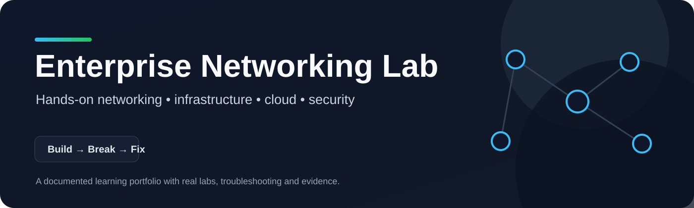

<p align="center">
  
</p>

<p align="center">
  <strong>A hands-on portfolio for networking, infrastructure, cloud and security.</strong>
</p>

<p align="center">
  
  
  
</p>

---

## About This Repository

This repository documents my progression from foundational networking into infrastructure, cloud and security engineering.

It is a **learning record, not a collection of claimed completed work**. A lab is only marked complete after it has been built, tested, deliberately broken, troubleshot and documented with evidence.

> **Current milestone:** Lab 04 — DHCP  
> Automating IPv4 addressing for the existing VLAN-based network.

## Learning Roadmap

| Lab | Topic | Status |
|---|---|---|
| [01](./labs/01-basic-lan/) | Basic LAN Connectivity | 🟡 In progress |
| [02](./labs/02-vlans/) | VLAN Segmentation | ✅ Completed |
| [03](./labs/03-inter-vlan-routing/) | Inter-VLAN Routing | ✅ Completed |
| [04](./labs/04-dhcp/) | DHCP | 🟡 In progress |
| [05](./labs/05-acls/) | Access Control Lists | ⚪ Not started |
| [06](./labs/06-enterprise-network/) | Mini Enterprise Network | ⚪ Not started |
| [07](./labs/07-linux-infrastructure/) | Linux Infrastructure | ⚪ Not started |
| [08](./labs/08-cloud-infrastructure/) | Cloud Infrastructure | ⚪ Not started |
| [09](./labs/09-security-monitoring/) | Security Monitoring / SOC | ⚪ Not started |

## What Each Lab Must Prove

Every completed lab should answer six questions:

1. **What did I build?**
2. **Why was it designed that way?**
3. **How did I verify it worked?**
4. **What did I deliberately break?**
5. **How did I diagnose the problem?**
6. **How did I fix it?**

Real screenshots, configuration files and troubleshooting notes are added only after the corresponding work has actually been performed.

## Career Direction

```text
IT Support
    ↓
NOC / Network Engineering
    ↓
Infrastructure / Cloud Engineering
    ↓
Network / Cloud Security Engineering
```

## Repository Structure

<details>
<summary><strong>View lab folders</strong></summary>

```text
labs/
├── 01-basic-lan/
├── 02-vlans/
├── 03-inter-vlan-routing/
├── 04-dhcp/
├── 05-acls/
├── 06-enterprise-network/
├── 07-linux-infrastructure/
├── 08-cloud-infrastructure/
└── 09-security-monitoring/
```

</details>

## Current Focus — Lab 04

**Goal:** replace manual host addressing with DHCP while keeping the existing VLAN and inter-VLAN routing design.

**DHCP scope plan:**

| VLAN | Department | Network |
|---|---|---|
| 10 | HR | `192.168.10.0/24` |
| 20 | Sales | `192.168.20.0/24` |
| 30 | IT | `192.168.30.0/24` |

→ [Open Lab 04](./labs/04-dhcp/)

---

<p align="center">
  <sub>Built as a practical learning portfolio — evidence first, claims second.</sub>
</p>
