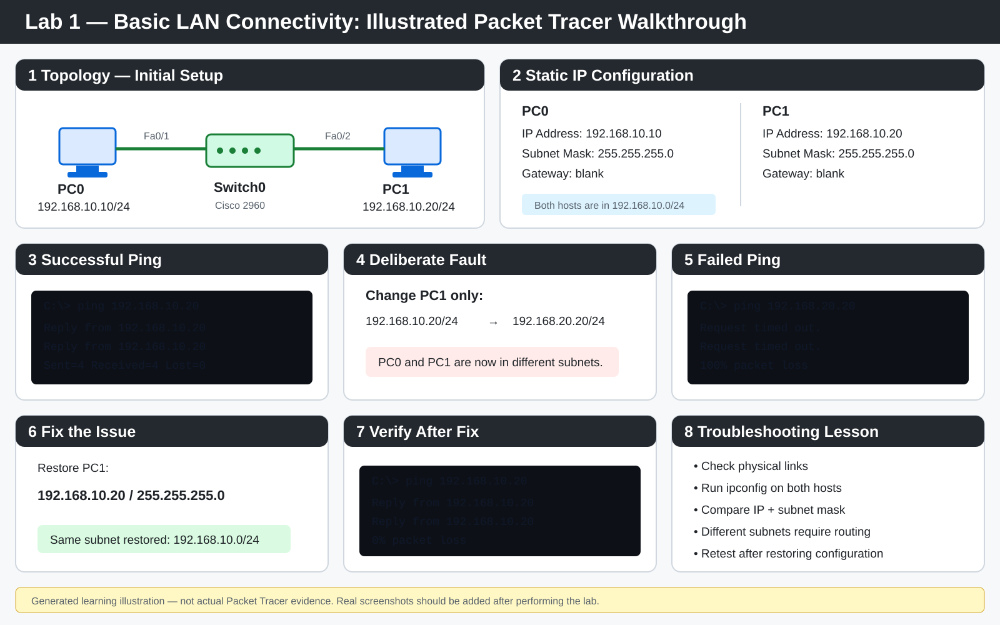

# Lab 1 — Basic LAN Connectivity

## Objective
Build a small LAN with two PCs and one switch, assign static IPv4 addresses, verify connectivity, then deliberately break the configuration and troubleshoot it.

## Topology
```
PC0 -------- Switch0 -------- PC1
```

## Addressing Plan
| Device | IP Address | Subnet Mask |
|---|---|---|
| PC0 | 192.168.10.10 | 255.255.255.0 |
| PC1 | 192.168.10.20 | 255.255.255.0 |

## Tasks
- [ ] Add 2 PCs and 1 Cisco 2960 switch in Packet Tracer
- [ ] Connect both PCs with copper straight-through cables
- [ ] Configure static IPv4 addresses
- [ ] Test connectivity with `ping`
- [ ] Change PC1 to 192.168.20.20/24
- [ ] Observe the failed ping
- [ ] Explain why devices on different networks need routing
- [ ] Restore the working configuration

## Commands / Checks
```
ping 192.168.10.20
ipconfig
```

## Evidence to Add
- [ ] Screenshot of working topology
- [ ] Screenshot of successful ping
- [ ] Screenshot of failed ping
- [ ] Short troubleshooting note

## What I Should Be Able to Explain
- What an IP address is
- What a subnet mask does
- What a switch does
- Why hosts in the same subnet can communicate directly
- Why hosts in different subnets need a router

## Troubleshooting Notes
See [`troubleshooting.md`](./troubleshooting.md) for the deliberate subnet-mismatch fault, diagnosis process and fix.


## Illustrated Walkthrough

> **Note:** This is a generated learning illustration showing the intended workflow. It is not proof that the Packet Tracer lab was completed. Real screenshots should be added after performing the lab.



## Status
Not completed yet — Packet Tracer evidence still needs to be captured before this lab is marked complete.
