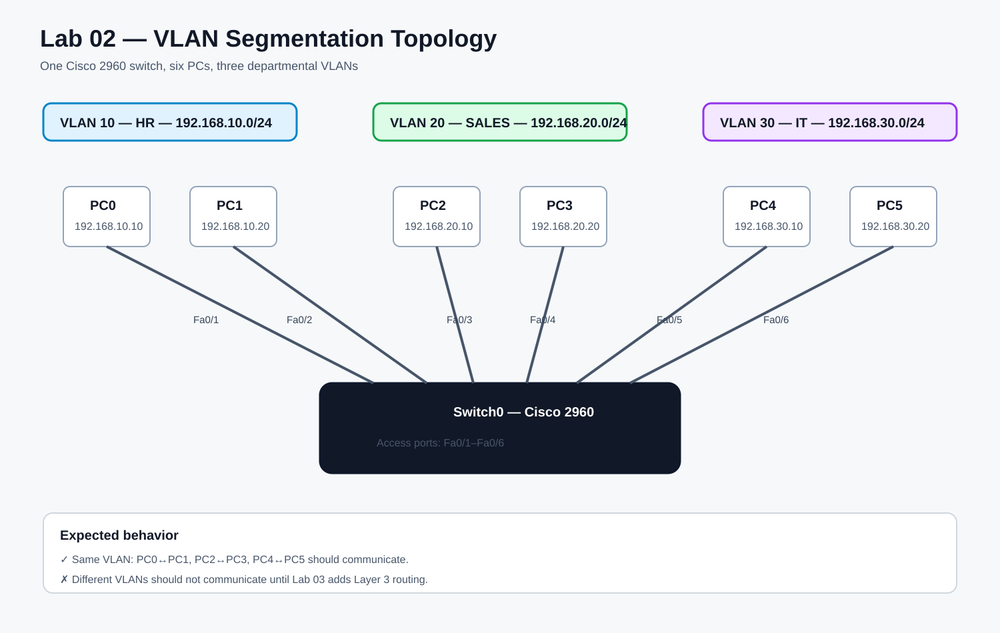

# Lab 2 — VLAN Segmentation

## Objective
Segment a small company network into separate departments using VLANs and verify Layer 2 isolation.

## Scenario
- HR — VLAN 10
- Sales — VLAN 20
- IT — VLAN 30

## Topology



```text
PC0 ── Fa0/1 ─┐
PC1 ── Fa0/2 ─┤  VLAN 10 — HR
               │
PC2 ── Fa0/3 ─┤
PC3 ── Fa0/4 ─┤  VLAN 20 — SALES
               │
PC4 ── Fa0/5 ─┤
PC5 ── Fa0/6 ─┘  VLAN 30 — IT
               │
            Switch0
            Cisco 2960
```

## Addressing Plan
| PC | Department | VLAN | IPv4 Address | Subnet Mask |
|---|---|---:|---|---|
| PC0 | HR | 10 | 192.168.10.10 | 255.255.255.0 |
| PC1 | HR | 10 | 192.168.10.20 | 255.255.255.0 |
| PC2 | Sales | 20 | 192.168.20.10 | 255.255.255.0 |
| PC3 | Sales | 20 | 192.168.20.20 | 255.255.255.0 |
| PC4 | IT | 30 | 192.168.30.10 | 255.255.255.0 |
| PC5 | IT | 30 | 192.168.30.20 | 255.255.255.0 |

Leave default gateways blank for this lab because inter-VLAN routing is not configured yet.

## Port Assignment
| Switch Ports | VLAN | Department |
|---|---:|---|
| Fa0/1–2 | 10 | HR |
| Fa0/3–4 | 20 | SALES |
| Fa0/5–6 | 30 | IT |

## Build Guide

Follow the full [`packet-tracer-build-guide.md`](./packet-tracer-build-guide.md) for the hands-on Packet Tracer steps.

## Configuration
Use [`switch-config.txt`](./switch-config.txt) for the full Cisco 2960 configuration.

## Verification
Same-VLAN tests should succeed:
```text
PC0 -> ping 192.168.10.20
PC2 -> ping 192.168.20.20
PC4 -> ping 192.168.30.20
```

Cross-VLAN tests should fail:
```text
PC0 -> ping 192.168.20.10
PC0 -> ping 192.168.30.10
```

This is expected because a Layer 2 switch does not route between VLANs.

## Troubleshooting Exercise
After verifying the working design, deliberately assign Fa0/2 to the wrong VLAN and diagnose the failure.

See [`troubleshooting.md`](./troubleshooting.md).

## Tasks
- [x] Add 6 PCs and 1 Cisco 2960 switch
- [x] Connect PCs to Fa0/1 through Fa0/6
- [x] Configure all six static IPv4 addresses
- [x] Create VLAN 10, VLAN 20 and VLAN 30
- [x] Name the VLANs HR, SALES and IT
- [x] Assign access ports to the correct VLANs
- [x] Verify membership with `show vlan brief`
- [x] Verify same-VLAN communication
- [x] Verify cross-VLAN communication fails
- [x] Perform the wrong-VLAN troubleshooting exercise
- [x] Restore the correct VLAN assignment
- [x] Save the Packet Tracer `.pkt` file

## Evidence
Real evidence was captured during the Packet Tracer session. See [`evidence/verification.md`](./evidence/verification.md) for the verified outcomes and file hashes.

- [x] Topology screenshot verified
- [x] `show vlan brief` screenshot verified
- [x] Successful same-VLAN ping verified
- [x] Failed cross-VLAN ping verified
- [x] Wrong-VLAN failure verified
- [x] Successful ping after the VLAN fix verified
- [x] Packet Tracer `.pkt` file produced

## What I Should Be Able to Explain
- What a VLAN is
- Why VLANs create separate broadcast domains
- What an access port is
- Why hosts in the same VLAN can communicate directly
- Why hosts in different VLANs cannot communicate without routing
- How `show vlan brief` helps troubleshoot VLAN membership

## Status
✅ Completed — VLAN segmentation was built, tested, deliberately broken, diagnosed, repaired, and verified.
