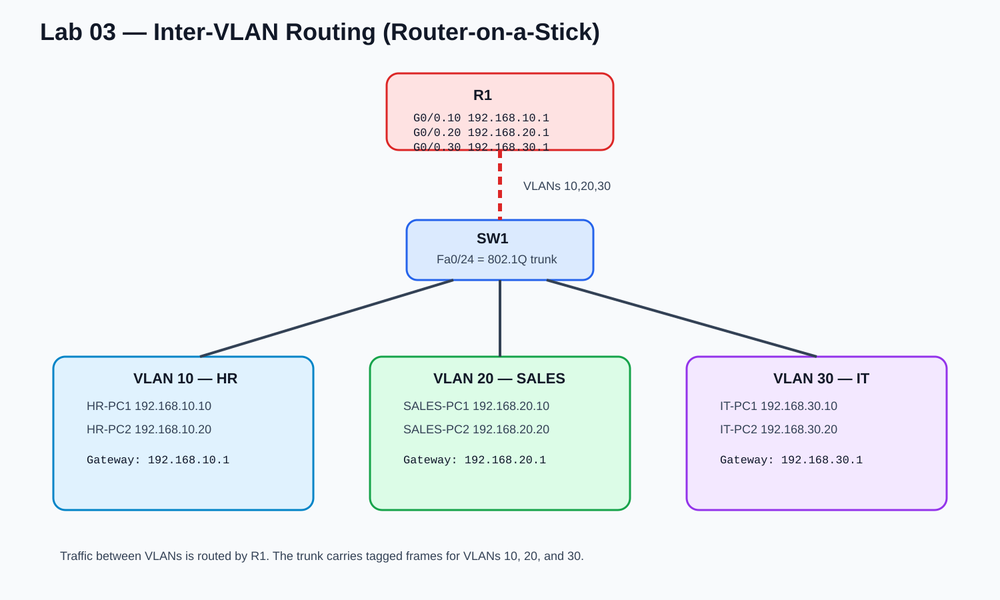

# Lab 3 — Inter-VLAN Routing

## Objective
Allow HR, Sales, and IT VLANs from Lab 2 to communicate using router-on-a-stick.

## Design
| VLAN | Department | Network | Default Gateway |
|---|---|---|---|
| 10 | HR | `192.168.10.0/24` | `192.168.10.1` |
| 20 | Sales | `192.168.20.0/24` | `192.168.20.1` |
| 30 | IT | `192.168.30.0/24` | `192.168.30.1` |

R1 uses subinterfaces on `G0/0`, while SW1 uses `Fa0/24` as an 802.1Q trunk.

## Files
- [`packet-tracer-build-guide.md`](./packet-tracer-build-guide.md) — hands-on build steps
- [`router-config.txt`](./router-config.txt) — R1 configuration
- [`switch-trunk-config.txt`](./switch-trunk-config.txt) — SW1 trunk configuration
- [`troubleshooting.md`](./troubleshooting.md) — incorrect-gateway fault exercise
- [`evidence/`](./evidence/) — real Packet Tracer evidence

## Tasks
- [x] Copy Lab 2 into a new Lab 3 `.pkt` file
- [x] Add router R1
- [x] Connect R1 G0/0 to SW1 Fa0/24
- [x] Configure Fa0/24 as an 802.1Q trunk
- [x] Configure router subinterfaces for VLANs 10, 20, and 30
- [x] Configure one default gateway per VLAN
- [x] Verify `show interfaces trunk`
- [x] Verify `show ip interface brief`
- [x] Verify cross-VLAN host communication with Sales
- [x] Verify inter-VLAN routing between IT and HR
- [x] Perform the incorrect-default-gateway troubleshooting exercise
- [x] Restore the gateway and retest
- [x] Save `lab03-inter-vlan-routing.pkt`

## Expected Result
Cross-VLAN pings that failed in Lab 2 should now succeed because R1 is routing between the three VLANs.

## Skills
- Default gateways
- IEEE 802.1Q trunking
- Router subinterfaces
- Router-on-a-stick
- Inter-VLAN routing
- Layer 2 vs Layer 3 troubleshooting

## Status
✅ Completed — router-on-a-stick, 802.1Q trunking, inter-VLAN host communication, deliberate gateway failure, diagnosis, repair, and recovery were all verified.
